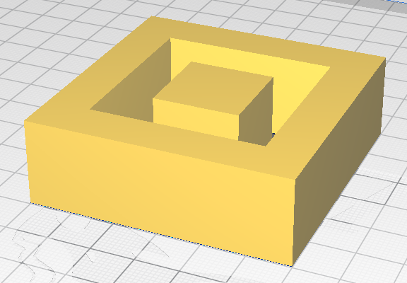

# Scadi

Scadi is a **Ruby wrapper around OpenSCAD which aims to act like a preprocessor**.

Scadi models are written in Ruby. They use a DSL which makes them look fairly similar to vanilla
OpenSCAD, albeit with the order of operations changed slightly:

```ruby
union {
  difference {
    square(60)
    square(40).translate(10)
  }
  square(20).translate(20)
}
  .extrude(20)
```



It's not there yet, but the idea is that this will allow you to write more expressive and flexible
models. Using multiple render passes with introspection in-between each, you can create models which
depend on different parts of themselves (e.g. "make this dimension 20mm longer than this one").

## Usage

First, check out, and install dependencies with `bundle`.

There's a currently-WIP command-line interface - use this command to render your Scadi file into an
STL at a temporary path:

```
bundle exec ruby bin/scadi.rb render <whatever.scadi>
```

Or compile into an OpenSCAD file for previewing using:

```
bundle exec ruby bin/scadi.rb preview <whatever.scadi>
```

## Naming

I was playing a lot of Dota 2 when I started thinking about this project. It features an item called
[Eye of Skadi](https://dota2.fandom.com/wiki/Eye_of_Skadi), and I couldn't _not_ think of "SCAD" 
whenever I heard that name.
